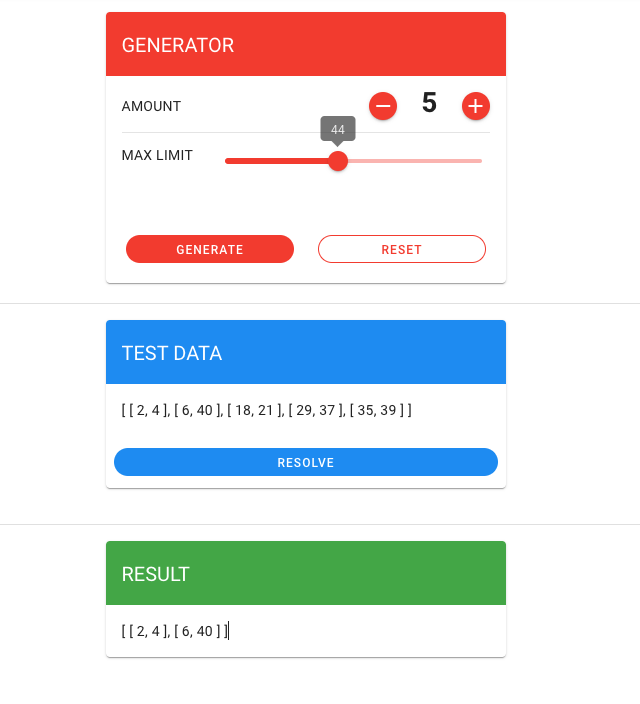

# Coding Task 2



Hier befindet sich die Lösung der Coding Task 2 - Aufgabe.

## Gliederung

1. [Allgemeines](#allgemein)
2. [Aufgabe](#aufgabe)
3. [Rahmendaten](#rahmendaten)
4. [Benutzerhandbuch](#benutzerhandbuch)
5. [Tests](#tests)

## Allgemein

1. Bearbeitungszeit

- Algorithmus und Berechnungen: Ungefähr 30 minuten
- Programmierung frontend, funktionen und tests: ca 5 Stunden mit Pausen dazwischen. Es wurde nicht durchgängig an einem Stück dran gearbeitet

2. Programmiersprache

- Auswahl fiel auf typescript, da die angestrebte Position und Tätigkeit hauptsächlich dort liegt

## Aufgabe

Vorbemerkung: So eine ähnliche Aufgabe musste ich in meinem Studium als Zulassungsaufgabe für die Prüfung im Bereich Algorithmen und Datenstrukturen bearbeiten. Daher ist das Thema hier für mich nicht ganz so neu.

### Lösungsansatz

Diese Aufgabe kann mithilfe eines Stacks gelöst werden, wo dann die Eingabeliste durchiteriert von vorne bis hinten mit dem obersten Element des Stacks verglichen wird. Vorher muss die Liste aufsteigend sortiert werden.

Verglichen werden der Endwert des Tuples vom obersten Stackelement mit dem Start- und Endwert vom jeweiligen Listenelement. Ist der Endwert vom obersten Stackelement kleiner als der Startwert des zu bearbeitenden Listenlements, so wird das Listenelement sofort als neues Topelement in den Stack gepushed. Ist es nicht der Fall, so wird das der Endwert des Topstack-Elements mit dem Endwert des Listenelements verglichen. Ist der Endwert des Topelements kleiner als der Endwert des Listenelements, so wird der Endwert des Topstacks mit dem Endwert des Listenelements ersetzt,

## Rahmendaten

1. Laufzeit des Programms

   - Die Liste muss einmal aufsteigend sortiert werden. Der Sortieralgorithmus in Javascript/Typescript basiert auf den TimSort-Algorithmus, welches eine Zeitkomplexität von O(n log n) hat

2. Wie kann die Robustheit sichergestellt werden, vor allem auch mit Hinblick auf sehr große
   Eingaben ?

   - Die Liste muss im vornherein sortiert werden. Das spätere Merging der Intervaldaten verläuft dann zuverlässig egal wie groß die Datenmenge ist

3. Wie verhält sich der Speicherverbrauch deines Programms?

   - Durch den Einsatz eines Stacks, muss extra O(n) Speicher eingeplant werden

## Benutzerhandbuch

Das Projekt ist ein Nuxt-Projekt und kann mit folgendem Befehl gestartet werden.

```bash
# Ausführung des Projekts
bun dev
```

Das Projekt besteht aus 3 Widgets.

1. Zufallsgenerator
   - durch das Einstellen von Anzahl der Testdaten und die Obergrenze für den Zahlenwert mit denen Zufallszahlen generiert werden, können dann Zeitintervalle zufällig erstellt werden
   - ist eine manuelle Eingabe nötig, so kann diese separat im Unit-Test eingegeben werden. Ein Testbeispiel liegt bei "tests/unit/function" und kann auch zum testen ausgeführt werden
2. Testdatenanzeige
   - hier werden die Testendaten angezeigt. Mit dem Button kann dort das Merging gestartet werden.
3. Ergebnisanzeige
   - hier wird das fertige Ergebnis angezeigt

## Tests

Die Dokumenation ist größtenteils im Code hinterlegt. Mit folgenden Befehlen können die Tests ausgeführt werden.

```bash
# Unit-Test
bun unit-test

# E2E-Test
bun e2e-test
```
